# Dynamic Insights: Exploring Earnings & Game Genres in Esports (1998 - 2023) 🎮📈
-------------

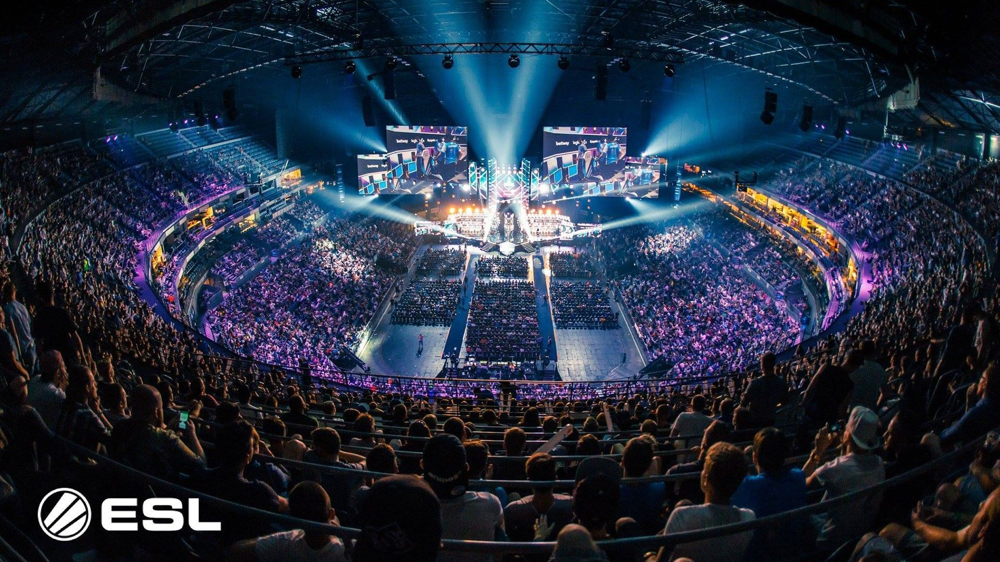

-----------

In the rapidly evolving landscape of digital entertainment, a new phenomenon has emerged that has captured the attention and passion of millions worldwide: Esports. Short for "electronic sports," Esports refers to competitive video gaming, where skilled players or teams face off against each other in virtual arenas, competing for victory, glory, and significant monetary rewards. Unlike traditional sports, Esports leverages the power of cutting-edge technology and the internet to create a captivating and fast-paced competitive environment that transcends geographical boundaries.

Over the past few decades, Esports has evolved from a niche hobby among gaming enthusiasts into a global cultural phenomenon with a massive following.

In this ever-evolving digital age, Esports stands at the forefront of innovation, pushing the boundaries of what is possible in the world of gaming and competitive entertainment. Its meteoric rise has captured the imagination of a generation, and its future is bound to be bright, promising even more thrilling competitions, larger audiences, and an enduring legacy in the annals of entertainment history.

------------------

This project aims to conduct an exploratory data analysis (EDA) of the Esports industry, focusing on earnings and game genres. The objective is to unveil insightful trends and findings, shedding light on the dynamic and rapidly growing world of competitive gaming. The dataset at hand comprises comprehensive data, rankings, and historical information on earnings in the Esports industry, making it a valuable resource. Nonetheless, it is essential to acknowledge that the reliance on reported data from the site might pose potential limitations concerning its absolute reliability. Despite this, the study holds significant potential in providing valuable insights into the financial aspects of Esports.

These are some of the questions/insights that we are going to explore in this dataset,

**1. Total earnings in the last 10 years?**

**2. Top 10 games earnings?**

**3. Top 10 games earnings in the last 5 years?**

**4. Top 10 games tournaments in the last 5 years?**

**5. Total earnings by genre?**

**6. Tournaments by genre?**

**7. Earning by genre in the last 5 years?**

   
----------------------

The dataset is scraped from EsportsEarnings.com which is available on 
Kaggle(https://www.kaggle.com/datasets/rankirsh/esports-earnings) 

**The dataset contains two tables**

1. "Games" - It contains information about games with 7 features

* Game: The name of the game.
* ReleaseDate: The year when the game was released.
* Genre: Genre of the game.
* TotalEarnings: The total earnings of the game in US dollars.
* OnlineEarnings: The earnings of the game through online in US dollars.
* TotalPlayers: The total number of players of the game.
* TotalTournaments: The total number of tournaments held for the game.

2. "Earnings" - It contains information about tournaments with 5 features

* Date: The date when the tournaments took place.
* Game: The name of the game associated with the tournaments.
* Earnings: The earnings from the tournaments.
* Players: The number of players who participated in the tournaments.
* Tournament: The number of tournaments held for the game on that specific date.

---------------

## Exploratory Data Analysis
In this section I will try to reveal some insights and trends in earnings, tournaments and popularity of games/genres in the eSports industry.

### Total earnings in the last 10 years?

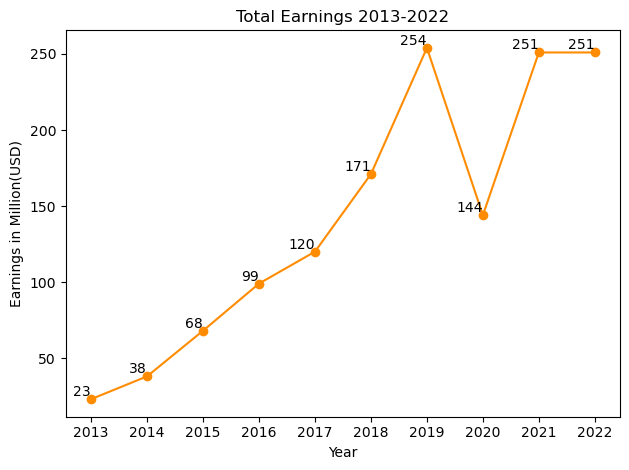

As we can see in the line plot, the total earnings of the industry were **growing every year, and in the year 2019, it reached a peak of $253M (11 times more than the year 2013!)**

We can also observe a decrease in the year **2020**, which can be attributed to the global impact of the **COVID-19** pandemic, affecting numerous industries. However, in the two years post-pandemic, we can see a recovery in earnings, and I believe that it will continue to grow even more in the coming years.

------

### Top 10 games earnings

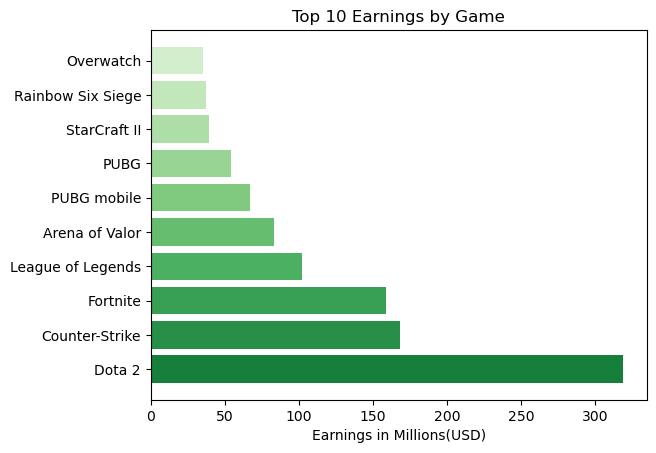

The top-earning game is **Dota 2**, which was released in 2013, with total earnings of **$315M.**

It is interesting to note that the top four games on the list have each earned more than **$100M.**

Another interesting insight is that **Fortnite**,the latest game on the list released in 2017, has earned nearly the same as **Counter-Strike**, which was released back in 2000.

Despite its early release, **Counter-Strike** is still very popular game among players.

Ultimately, most of the games on this list were released from **2013** onwards, which show the growth of the esports industry in recent years.

---------

### Top 10 games earnings in the last 5 years

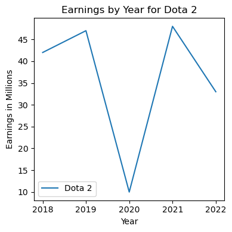
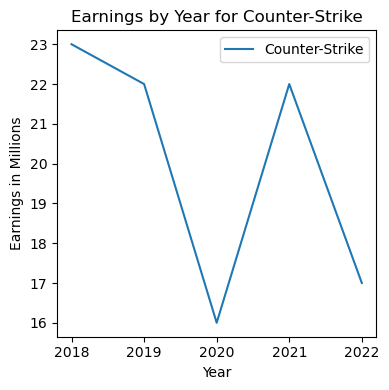
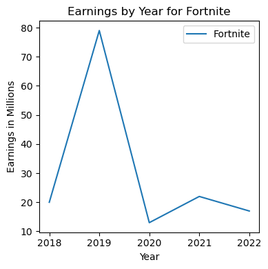
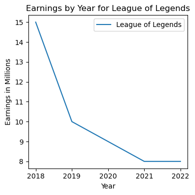
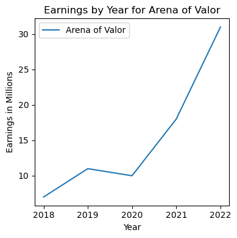
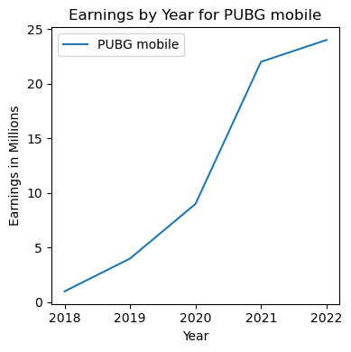
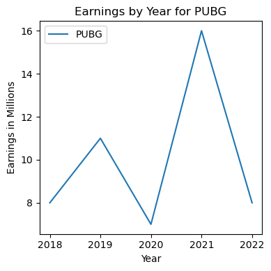
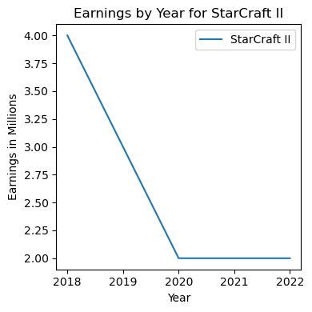
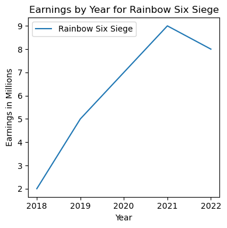
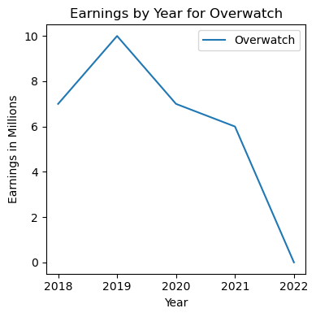

The different plots show various trends:

* Most of the games show an **increase from 2018 to the following year 2019.**

* In **2020**, we can see that most of the games earned **less** than the previous years due to **COVID-19.** **The exception is PUBG Mobile**, and it's probably related to the fact that players could still participate in tournaments despite the global pandemic.

* Most of the games show **recovery in 2021**, post-pandemic. Some even reach their **peak earnings (Dota 2, PUBG, Rainbow Six Siege).**

* The games show **differences in 2022** - some continue to **grow (like Arena of Valor), some decline (like Counter-Strike and Fortnite)**, and **some remain stable (like StarCraft II).** With each passing year, new games from different genres offer players bigger prizes and opportunities, contributing to the industry's competition and growth.

* By analyzing the plots **individually**, we can observe that the difference over the **last two years is insignificant, and the top 10 games still earn a lot and control the market.** This may be related to the genre of the game, market competition, releasing new content or updates for the game, and other factors.

----------------

### Top 10 games tournaments in the last 5 years

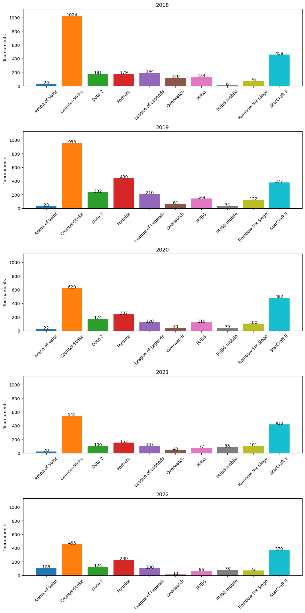

From the bar plots we can learn the following trends:

* In **2019, there is a correlation with the earnings line plots.** Most of the games had more tournaments, which correlates with the observation that these games earned more. Additionally, the games that earned less showed a decrease in the number of tournaments.

* In **2020, there is also a correlation with the earnings.** All games, except PUBG Mobile and StarCraft II, showed a **decrease** in the number of tournaments. An interesting insight is that StarCraft II had more tournaments than in 2018, but earned only half the amount.

* Another interesting observation is what happened in **2021.** Although the earnings showed **recovery, most of the games continued to drop in the number of tournaments.** This suggests that the industry, post-pandemic, changed its approach and held fewer tournaments with larger prize pools.

* In 2022, the trend is similar to the previous year. Most games held fewer tournaments, but the earnings didn't show a significant change. This indicates that the prizes per tournament grew, but there were fewer tournaments held overall.

These insights provide valuable information about the relationship between the number of tournaments and earnings in the last years, highlighting the evolving dynamics of the industry.

-----

### Total earnings by genre

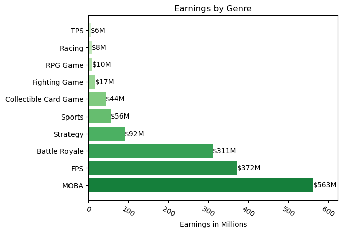

The genre earning the most in total is **MOBA (Multiplayer Online Battle Arena), with a total of $555M**. The top games in this genre include Dota 2, League of Legends, and Arena of Valor.

Following that, the **FPS (First-Person Shooter) genre ranks second with a total of $356M**. Popular games in this genre are Counter-Strike, Rainbow Six Siege, and Overwatch.

The **Battle Royale genre secures the third position with a total of $303M**, featuring games like Fortnite, PUBG, and PUBG Mobile.

It is apparent that all of the top 10 games in terms of earnings belong to these leading genres, highlighting the correlation between genre popularity and earnings.

-------------------

### Tournaments by genre

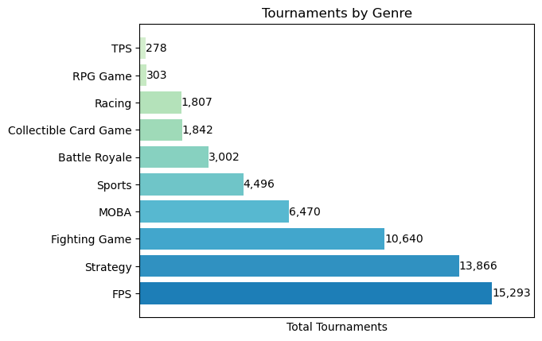

**FPS (First-Person Shooter) is the genre with the highest number of tournaments held**. This can be attributed to its status as an old and established genre, with games like Counter-Strike released back in 2000.

**Strategy and Fighting-game genres have a high number of tournaments held but low earnings.** This suggests that, apart from StarCraft II in the Strategy genre, the prize pools per tournament in these genres may be lower than in others.

**MOBA (Multiplayer Online Battle Arena) genre holds the fourth position in terms of tournaments held but leads in earnings.** This can indicate that higher prize pools per tournament offered in this genre.

An interesting insight is that **Battle Royale genre, which held four times fewer tournamnets than FPS, earned almost the same amount.This genre gained popularity relatively late, with its popular games being released around 2017.**

Surprisingly, **the Sports genre secures a spot in the top five**, implying a genre with high number of tournaments but likely with smaller prize pools.

------------------------

### Earning by genre in the last 5 years

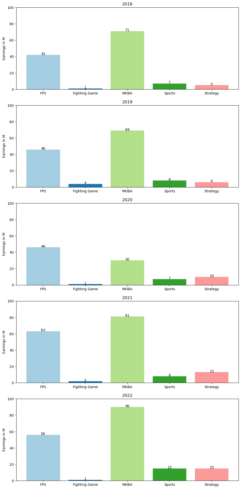

From the bar plots we can learn the following insights:

**MOBA, Sports, and strategy** show an increase in earnings, reaching their highest earnings in 2022.

**FPS genre show consistent growth from 2018 to 2021 but a slight decrease in 2022.**
However, the difference is relatively small as this genre still earned considerably more than most others.

**Fighting-Game genre show no clear trend, with earnings Shifting between higher and lower values.** The genre reached its peak earnings in 2019, and in 2022 it remained the same as in 2018.

----------------------

## Conclusion

In conclusion, the research findings demonstrate a noteworthy upsurge in the Esports industry, garnering global interest. The comprehensive analysis conducted over the past five years has yielded invaluable insights into the interplay between genres, tournaments, and earnings within the sector.

The data has unveiled compelling trends, particularly highlighting the prevalence of specific games and genres in generating higher earnings, as well as the fluctuating frequency of organized tournaments. These observations offer significant implications for stakeholders in the Esports industry, game developers, and enthusiasts alike.

Given the comprehensive nature of this project, it is anticipated to serve as a valuable resource for various stakeholders, providing a thorough overview of the Esports economy and its evolving trends. Its in-depth analysis has the potential to inform strategic decision-making, spur innovation, and stimulate further growth within this dynamic and rapidly expanding domain.

